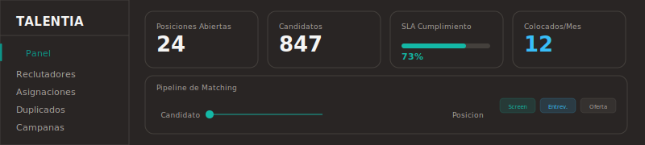

<div align="center">





[](https://nextjs.org/)
[](https://supabase.com/)
[](https://www.typescriptlang.org/)
[](https://tailwindcss.com/)

[](LICENSE)
[](https://github.com/JDRV-space/talentia/pulls)

[Features](#features) - [Getting Started](#getting-started) - [Architecture](#architecture) - [Key Algorithms](#key-algorithms) - [License](#license)

</div>

## Features

- **Smart Assignment Engine:** Weighted algorithm matching recruiters to positions by zone, capability level, and workload balance
- **Spanish Phonetic Deduplication:** Custom engine handling yeismo, seseo, h muda, and Quechua/Aymara surname patterns
- **Demand Forecasting:** Production data to headcount predictions with seasonal crop multipliers
- **Excel Pipeline:** Browser-side parsing of 90MB+ files with zero server upload limits
- **SLA Tracking:** Priority queues (Critical / Technical / Standard) with deadline alerts
- **Workload Redistribution:** Automatic proposals to rebalance overloaded recruiters
- **Full Auth:** Supabase Auth with Row-Level Security policies on every table

## Tech Stack

| Layer | Technology |
|-------|-----------|
| Framework | Next.js 16 (App Router) |
| Database | Supabase (PostgreSQL + Auth + RLS) |
| UI | shadcn/ui + Tailwind CSS 4 |
| Validation | Zod 4 + TypeScript 5 |
| Testing | Vitest |
| Deployment | Vercel (Edge + Serverless) |
| Storage | Cloudflare R2 |

## Getting Started

### Prerequisites

- Node.js 18+
- Supabase project ([free tier](https://supabase.com/dashboard) works)
- Cloudflare R2 bucket (optional, for Excel uploads > 4.5MB)

### Setup

```bash
# 1. Clone
git clone https://github.com/JDRV-space/talentia.git
cd talentia

# 2. Install
npm install

# 3. Environment
cp .env.example .env.local
# Fill in your Supabase and R2 credentials

# 4. Database
npx supabase db push

# 5. Run
npm run dev
```

Open [http://localhost:3000](http://localhost:3000).

## Architecture

```
src/
├── app/                        # Next.js App Router
│   ├── (dashboard)/            # Protected routes
│   │   ├── panel/              # KPI dashboard
│   │   ├── posiciones/         # Position CRUD
│   │   ├── candidatos/         # Candidate search & dedup
│   │   ├── reclutadores/       # Recruiter workload cards
│   │   ├── asignaciones/       # Assignment engine UI
│   │   ├── pronostico/         # Demand forecasting calendar
│   │   ├── campanas/           # Campaign management
│   │   ├── duplicados/         # Duplicate resolution
│   │   ├── subir/              # Excel upload wizard
│   │   └── configuracion/      # Settings
│   ├── api/                    # 18 API endpoints
│   └── auth/                   # Auth callback
├── components/
│   ├── ui/                     # shadcn/ui primitives
│   ├── layout/                 # App shell (sidebar, header)
│   ├── dashboard/              # KPI cards, charts, alerts
│   ├── positions/              # Position table, filters, SLA badges
│   ├── candidates/             # Candidate search, dedup panel
│   ├── recruiters/             # Workload cards, redistribution
│   ├── forecast/               # Forecast calendar, zone cards
│   └── upload/                 # Excel dropzone, duplicate modal
├── lib/
│   ├── algorithms/             # Core business logic
│   │   ├── assignment.ts       # Weighted recruiter matching
│   │   ├── dedup.ts            # Spanish phonetic deduplication
│   │   ├── forecast.ts         # Demand forecasting engine
│   │   ├── labor-ratios.ts     # Production-to-headcount conversion
│   │   ├── priority.ts         # SLA priority scoring (3 queues)
│   │   └── redistribution.ts   # Workload rebalancing
│   ├── excel/                  # Excel parsing (browser + server)
│   ├── supabase/               # Database client (server + browser)
│   └── r2/                     # Cloudflare R2 storage
├── hooks/                      # Custom React hooks
├── types/                      # TypeScript types + Zod schemas
│   ├── constants.ts            # Business rules & SLA config
│   ├── database.ts             # Database row types
│   ├── schemas.ts              # Zod validation schemas
│   └── api.ts                  # API response types
└── middleware.ts                # Auth guard
```

### Database

13 sequential migrations in `supabase/migrations/`:

- Full schema with audit triggers
- Row-Level Security policies
- Atomic recruiter load management
- Capability level inference from historical data

## Key Algorithms

### Assignment Scoring

Positions are matched to recruiters using a weighted scoring model:

| Factor | Weight | Logic |
|--------|--------|-------|
| Zone Match | 30% | Primary zone = 1.0, Secondary = 0.5, No match = 0.0 |
| Capability Level | 30% | Recruiter level >= position level = full score |
| Workload Balance | 40% | Lower current load = higher score |

Hard blocks prevent assignment when `position_level > recruiter.max_position_level`.

### Spanish Phonetic Deduplication

Custom engine optimized for Latin American Spanish:

| Rule | Example |
|------|---------|
| Yeismo | `ll` = `y` (calle = caye) |
| Seseo | `c`(e/i) = `s` = `z` (Sanchez = Sanses) |
| H muda | `h` removed (Huaman = Uaman) |
| B/V fusion | `b` = `v` (Vega = Bega) |
| J/G softening | `j` = `g`(e/i) (Jimenez = Gimenez) |

Includes an indigenous surname dictionary for Quechua and Aymara names.

### Priority Scoring

Three-queue system with interleaving:

| Queue | Criteria | Ratio |
|-------|----------|-------|
| A: Critical | SLA > 80% consumed or < 2 days left | 2x |
| B: Technical | Specialized technical positions | 1x |
| C: Standard | All other positions | 1x |

Score formula: `(urgency x 400 + capability x 200 + value x 150 + volume x 150) x campaign_multiplier`

### Demand Forecasting

Classical seasonal decomposition to predict workforce needs:

```
Y(t) = Trend(t) + Seasonal(t) + Residual(t)
```

| Component | Method |
|-----------|--------|
| Trend | Moving average over historical production (kg) |
| Seasonal | 52-week repeating pattern extracted from campaign data |
| Residual | Random noise (used for confidence intervals) |

**Worker calculation:**
```
workers_needed = production_kg / (kg_per_worker_day x working_days x seasonal_factor)
```

Outputs 95% confidence intervals (Z = 1.96) and quality metrics per crop and zone.

### Labor Ratios

Derives real productivity ratios from historical data instead of hardcoded defaults:

```
ratio = production_kg / actual_workers_hired
```

| Input | Source |
|-------|--------|
| `production_kg` | Completed campaigns (PICOS data) |
| `actual_workers_hired` | Sum of `filled_count` from positions in the same zone with overlapping dates |

Calculates ratios at three levels of granularity: crop + zone, crop-only, and overall average (fallback). Includes confidence scoring based on sample size and variance.

### Workload Redistribution

Proposes moves to rebalance overloaded recruiters:

| Threshold | Value | Meaning |
|-----------|-------|---------|
| Overloaded | >= 13 active cases | Must offload |
| Available | < 10 active cases | Can receive |
| Target | 10 cases | Ideal post-redistribution load |

**Algorithm:**
1. Identify overloaded recruiters (>= 13 cases)
2. Identify available recruiters (< 10 cases)
3. Prefer same-zone transfers (primary/secondary zone match)
4. Calculate minimum moves to bring everyone to target load
5. Output a proposal with `from → to` moves and zone-match flags

## Scripts

```bash
npm run dev          # Development server
npm run build        # Production build
npm run lint         # ESLint
npm run test         # Vitest (run once)
npm run test:watch   # Vitest (watch mode)
npm run test:coverage # Coverage report
```

## License

[MIT](LICENSE)

